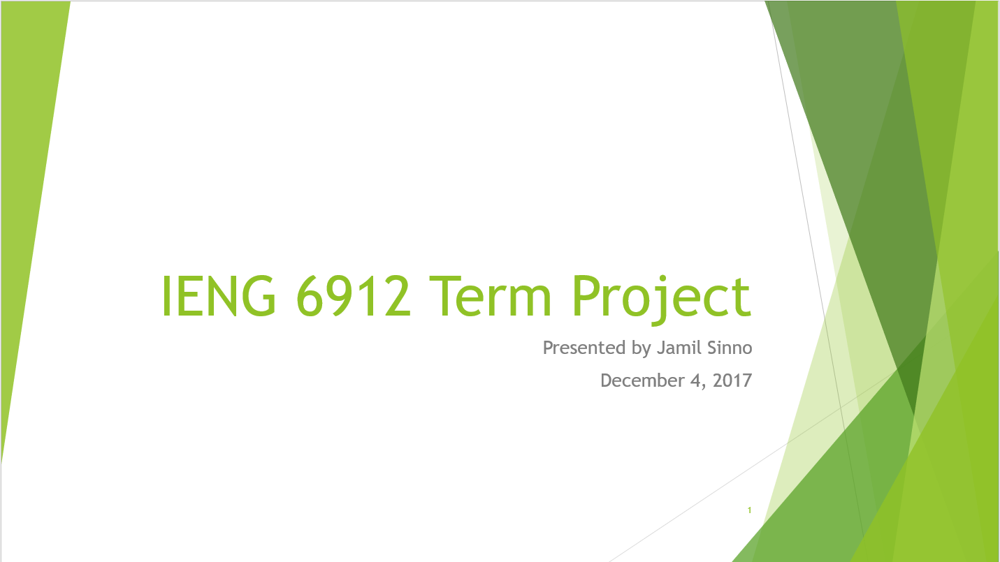

# travellingApp
This project was created as part of my Industrial Engineering degree. The project, the constraints, & the models were created by me. The point of the project was to find the optimal solution to the project we created.

**Link to project:** https://1drv.ms/p/s!AkPXqkA8Qy8mjW0kD1KhL9DlDRw7?e=yrS5dG

## How It's Made:

**Tech used:** Python, Pyomo, Gurobi

The project was built using Python and Pyomo. The optimal solution was found using Gurobi.